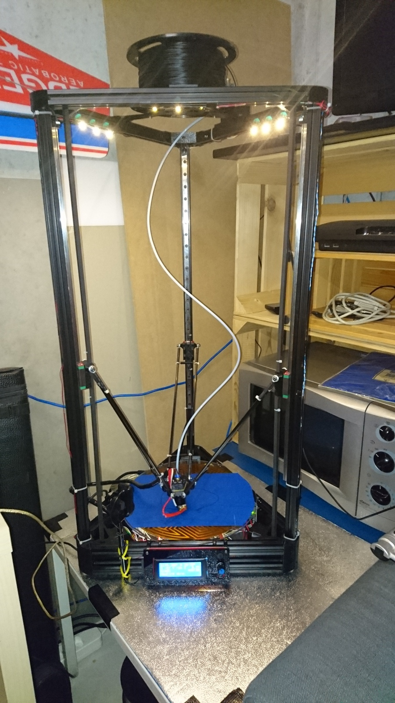

In den letzten zwei Wochen habe ich mir einen Kossel XL von <a href="http://de.aliexpress.com/wholesale?SearchText=kossel+xl" target="&quot;_blank">AliExpress</a> zusammengebaut und in Betrieb genommen. Obwohl ein paar Probleme dabei auftraten, war das Ganze grundsätzlich relativ einfach vonstatten gegangen.

Ich habe versucht, alles was ich so gelernt habe, in unserem <a href="https://rc.oxi.ch/index.php/Kategorie:3D_Drucker" target="_blank">RC Wiki</a> zu dokumentieren. Natürlich werde ich dieses auch in Zukunft weiter mit Wissenswertem abfüllen.

### Bestellung und Lieferung

Als neuer <a href="http://de.aliexpress.com/wholesale?SearchText=kossel+xl" target="&quot;_blank">AliExpress</a> Kunde war ich dem chinesischen Online Store natürlich auch kritisch gegenüber eingestellt. Vorallem bei Bestellungen ab einem gewissen Wert (ca. 450 Franken). Man hört ja alles mögliche&#8230; Komplett zu unrecht nach meinen Erfahrungen! Die Qualität hatte 2-3 Mängel. Aber wenn man den Preis berücksichtigt – man würde in der Schweiz wohl das Fünffache dafür ausgeben – ist das immer noch sehr gut. <a href="http://de.aliexpress.com/wholesale?SearchText=kossel+xl" target="&quot;_blank">AliExpress</a> ist ein Webportal wie <a href="https://www.amazon.de" target="&quot;_blank">Amazon</a>, in welchem diverse Shops ihre Waren anbieten. Die Mitarbeiter aus dem <a href="http://de.aliexpress.com/store/1800400" target="&quot;_blank">Store &#8220;shengshi&#8221;</a>, in welchem ich meinen Kossel XL gekauft habe, waren super freundlich und zuvorkommend. Alle meine Fragen wurden innerhalb 24 Stunden beantwortet und als ich ihnen mitgeteilt hatte, dass mein Heated-Bed Probleme macht, schickten sie mir kurzerhand einfach das neuere Modell. Komplett kostenlos versteht sich. Das unglaublichste war für mich jedoch, dass ich nach der Bestellung nur 6 Tage (!) auf die Lieferung des Druckers per DHL warten musste. 25 Franken Lieferkosten von 1.5 kg aus China in die Schweiz mit 6 Tagen Dauer ist unschlagbar!

### Denkfehler und technische Mängel

Die folgenden Probleme hatten mich leider teilweise viel Zeit gekostet. Somit brauchte ich ca. fünf Abende statt einen, um den Kossel XL in Betrieb zu nehmen. Nicht alle Probleme waren jedoch auf die China-Qualität zurückzuführen und hätten mit einer besseren Methodik meinerseits viel weniger Zeit in Anspruch genommen:

  * Hätte ich die SD Karte, welche verschweisst und ohne Kommentar mitgeliefert wurde, auch nur einmal in einen PC gesteckt, hätte ich mir sehr, sehr viel &#8220;trial & error&#8221; sparen können: Auf dieser befand sich eine komplette Bau-Anleitung (inkl. Videos). Ich hatte stattdessen YouTube build Videos geschaut, die aber nicht explizit für meinen Drucker waren. Auch waren jegliche Files, auf welche ich später noch eingehen werde, für die <a href="https://github.com/MarlinFirmware/Marlin" target="_blank">Marlin Firmware</a> auf der SD vorhanden. Sogar Anleitungen zum besseren Kalibrieren sowie diverse Applikationen wären vorhanden gewesen.
  * Bei den Endstops waren die Stecker falsch gecrimpt. Sie machten keinen Kontakt. Die Stecker wurden sicher nicht vom Shop selbst hergestellt, stellt aber ein klarer Qualitätsmangel dar. Hätte ich diese beim ersten Einbauen kurz getestet, hätte ich mir auch da viel Zeit sparen können, da ich als Neuling zuerst stundenlang in der <a href="https://github.com/MarlinFirmware/Marlin" target="_blank">Marlin Firmware</a> nach Konfigurationsfehlern gesucht hatte.
  * Das mitgelieferte Heated-Bed verbrannte zu viel Strom. Dies ist ein Fehler, der dem <a href="http://de.aliexpress.com/store/1800400" target="&quot;_blank">Shop</a> inzwischen bewusst ist. Deswegen werden heute andere Heated-Bed mit dem Drucker verschickt. Sobald das Neue angekommen ist und ich es eingebaut habe, werde ich schauen, ob es auch wirklich besser funktioniert. Das &#8220;alte&#8221; glasige mit aufgeklebtem Heizpad braucht 300 W (was zu viel ist für das <a href="http://reprap.org/wiki/RAMPS_1.4" target="_blank">RAMPS</a> board). Das &#8220;neue&#8221; (Aluminium mit integriertem Heizelement) soll 120 W brauchen. Ich habe schon mehrfach den <a href="https://de.wikipedia.org/wiki/Magic_Smoke" target="_blank">Magic Smoke</a> erlebt und <a href="https://de.wikipedia.org/wiki/Metall-Oxid-Halbleiter-Feldeffekttransistor" target="_blank">MOSFETs</a> verbrannt, weil ich das Heated-Bed ausreizen wollte und &#8220;rum gespielt&#8221; habe. Glücklicherweise sind die <a href="https://de.wikipedia.org/wiki/Metall-Oxid-Halbleiter-Feldeffekttransistor" target="_blank">MOSFETs</a> mehr oder weniger eine Sollbruchstelle (welche vorher noch mit einer Sicherung geschützt wären, würde man diese nicht zurücksetzen) und man kann diese relativ einfach selbst ersetzen. Vorausgesetzt man kann ein wenig mit dem Lötkolben umgehen. Ein entsprechender <a href="https://de.wikipedia.org/wiki/Metall-Oxid-Halbleiter-Feldeffekttransistor" target="_blank">MOSFET</a> kostet bei <a href="http://farnell.com/" target="_blank">farnell.com</a> ca. 2.50 Franken.
  * Leider war keine Filament-Spulenhalterung dabei. Dies war aber dann mein erstes, richtiges Druckprojekt. Ich habe die super coolen <a href="http://www.thingiverse.com/thing:454808" target="_bank">Gears</a> und die verlängerten Halter für den Kossel XL von <a href="https://www.thingiverse.com" target="_blank">Thingiverse</a> heruntergeladen, drucken und montieren können.

### Kalibrierung

Zum Kalibrieren habe ich einige <a href="http://www.thingiverse.com/thing:170922" target="blank">Calibration Cubes</a> und <a href="http://www.thingiverse.com/thing:24238" target="_blank">Calibration Cube Steps</a> ausgedruckt. Sobald diese ungefähr den richtigen Massen entsprachen, habe ich ein <a href="http://www.thingiverse.com/thing:763622" target="_blank">Benchy</a> ausgedruckt und war positiv überrascht wie gut es funktioniert hatte. Lediglich mit Warping hatte ich Probleme. Diese könnten/sollten sich mit dem neuen Heated-Bed lösen. Eine detaillierte Anleitung, was bei der <a href="https://rc.oxi.ch/index.php/G-Code#Tips_und_Tricks" target="_blank">Kalibrierung</a> zu tun ist, habe ich im Wiki hinterlegt.

### Marlin Firmware v1.0

Die mitgelieferte Firmware war Marlin 1.0. Diese ist inzwischen leider über ein Jahr alt. Das Tolle bei Opensource Software ist jedoch, dass ich nach dem Übernehmen der Parameter in die Konfiguration ganz einfach auf die aktuellen Version 1.1.0-RC3 updaten konnte. Ich habe dem Projekt ein <a href="https://github.com/MarlinFirmware/Marlin/issues/2932" target="_blank">Issue</a> erstellt, damit meine Beispielkonfiguration in <a href="https://github.com/MarlinFirmware/Marlin" target="_blank">Marlin</a> integriert werden könnte. Ich werde diese aber so oder so offenlegen, sobald ich damit zufrieden bin.

### Aktuelle Probleme

Der Drucker steht in meiner Werkstatt. Zurzeit beträgt die Raumtemperatur 14°C, was relativ kühl ist. Durch das Heated-Bed-Problem verschärft sich die Situation massiv. Durch diese Umstände habe ich das Problem, dass das Druckobjekt nicht gut genug auf der Platte klebt. Ich habe es mit diversen &#8220;Tricks&#8221; und deren Kombinationen versucht. So zum Beispiel:

  * Blaues Malerabdeckband
  * Haarspray
  * Fixierspray für Zeichnungen
  * Vorheizen mit Heissluftpistole (heizt zwar super, kühlt aber auch schnell wieder aus)

Leider funktioniert keiner dieser Tricks perfekt, solange das Heated-Bed kalt bleibt/wird.

### Upgrades

Da alles Opensource ist und dieser Drucker definitiv zum Weiterentwickeln ausgelegt ist, habe ich auch nach der selbst hergestellten Filament-Spulenhalterung noch weitere Projektideen für Druckerbestandteile. Diese werde ich hier auf der Seite jeweils auch dokumentieren:

  * Webcam Halterung
  * Smart LCD Controller Case
  * Einbau eines Relais, damit das eingebaute Arduino die 12V Versorgung selbst ein- und ausschalten kann
  * Eine neue &#8220;Arduino mit RAMPS&#8221; Halterung (die alte habe ich unabsichtlich zerstört)

### Eingesetzte Software

Ich habe mich für Opensource entschieden, wenn es um die Software geht. Dafür setze ich, als Slicer <a href="http://slic3r.org/" target="_blank">slic3r</a> ein und sende den <a href="https://rc.oxi.ch/index.php/G-Code" target="_blank">G-Code</a> dann direkt zu <a href="http://octoprint.org/" target="_blank">Octoprint</a>, welches auf einem <a href="https://www.raspberrypi.org/" target="_blank">Raspberry Pi 2</a> läuft.

### Opensource

Als Verfechter der Opensource-Bewegung, freue ich mich natürlich besonders, dass es wirklich möglich ist, alles komplett mit Opensource Soft- und Hardware zu betreiben:

  * <a href="http://reprap.org/wiki/Kossel" target="_blank">Kossel</a> XL
  * <a href="https://github.com/MarlinFirmware/Marlin" target="_blank">Marlin Firmware</a> auf einem <a href="https://www.arduino.cc/" target="_blank">Arduino Mega 2560</a>
  * <a href="http://reprap.org/wiki/RAMPS_1.4" target="_blank">RAMPS 1.4 EFB</a>
  * <a href="http://reprap.org/wiki/RepRapDiscount_Smart_Controller" target="_blank">Smart LCD Controller</a>
  * <a href="http://octoprint.org/download/" target="_blank">Octoprint (Octopi)</a>
  * <a href="http://slic3r.org/" target="_blank">slic3r</a>

### Erste Verwendungen

Als erstes habe ich diverse kleine und einfache Objekte von <a href="https://www.thingiverse.com" target="_blank">Thingiverse</a> gedruckt. Die hatten keinen konkreten Sinn und Zweck, machten aber richtig Spass.

Das erste kleine Projekt, welches ich selber entwarf und dann produzierte, ist eine Schranktürgriff-Montage. Dieses musste nachgebildet werden, da das Original abgebrochen war. Bis jetzt funktioniert das Ersatzteil super, wird wohl aber irgendwann brechen, da es an gewissen Stellen zu dünn wurde. Version 2 ist schon in Planung.

Stay tuned für weitere Artikel zu meinem Kossel XL und allgemein dem Thema 3D Drucker!
