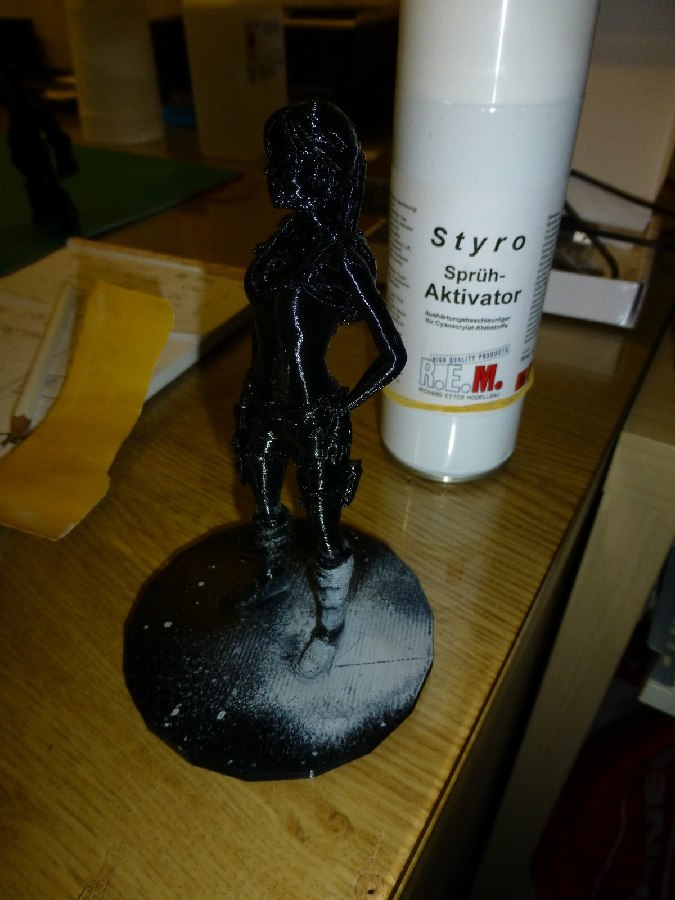
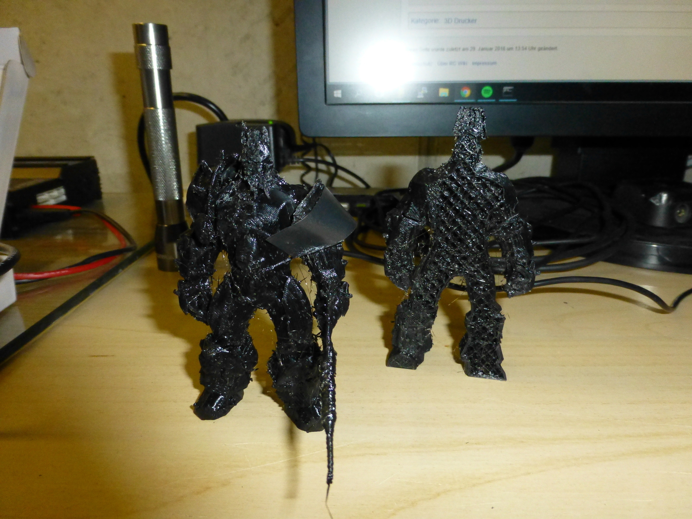

Sekundenkleber funktioniert super. Aktivator sollte man hingegen NICHT verwenden. Deswegen sind die Beine von Lara Croft so komisch grau geworden&#8230;

Stecker crimpen ist eine mühselige Arbeit. Wenn sie jedoch richtig gemacht wird, hält das Resultat dafür umso länger. Hier ein Beispiel eines schon ca. dreimal schlecht gecrimpten Steckers.

So sieht &#8220;Infill&#8221; aus (rechts, das quadratische Muster). Simpel, aber effizient, um Filament zu sparen und trotzdem stabile Druckergebnisse zu erzielen. Alle heutigen Slicer generieren Infill automatisch.

Das &#8220;magische&#8221; blaue Malerabdeckband hilft beim Druck, die Druckobjekte viel besser auf der Oberfläche haften zu lassen.
