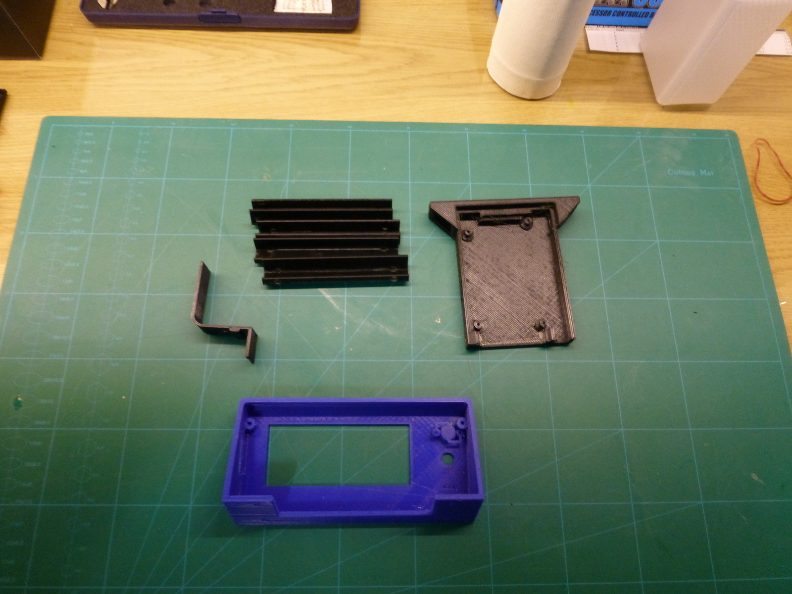
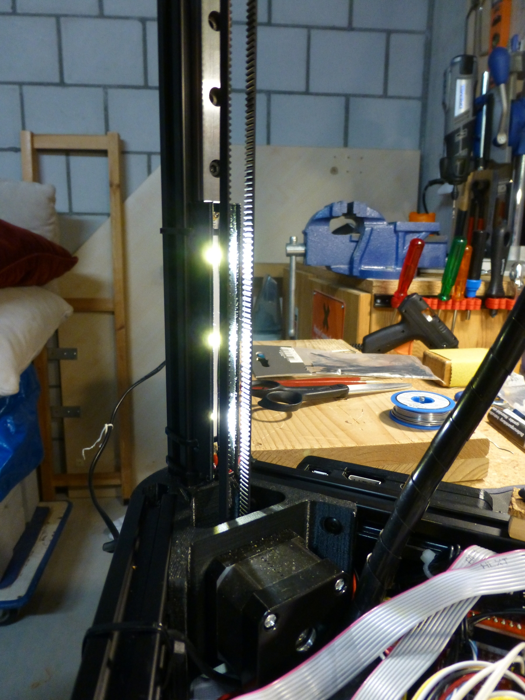
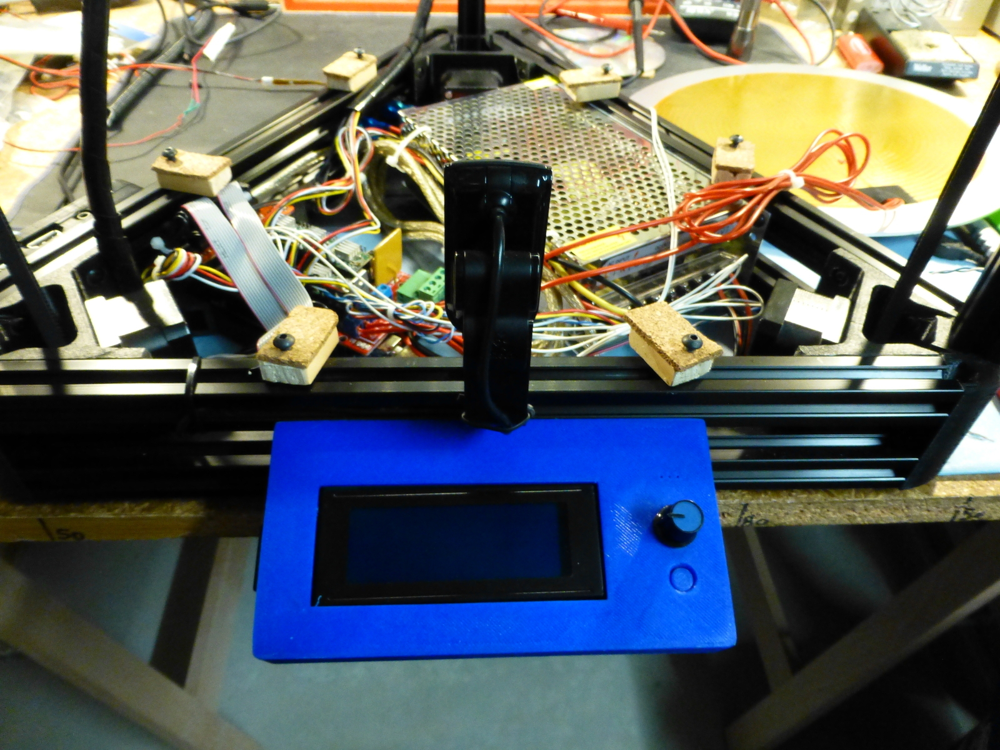

Vorletztes Weekend habe ich nebst Rise of the Tomb Raider doch noch Zeit gefunden, um die upgrades am Kossel XL auf einen guten Stand zu bringen. Diese umfassen:

* Neue Arduino Halterung
* Neues Heated-Bed
* Kamera Halterung
* LED Band Halterungen
* Smart LCD Controller Case

### Heated-Bed

Das neue Heated-Bed wurde mir nun tatsächlich ohne Aufpreis von <a href="http://www.aliexpress.com/store/1800400" target="_blank">shengshi</a> per Post geschickt. Was für ein Service!

Der mitgelieferte 120W heater und die Aluminium Platte haben bis jetzt tadellos funktioniert. Einzig die Montage des Thermistors muss ich noch optimieren. Zur Zeit weilt er in einem Tropfen Hitzeleitpaste unter Kapton Tape auf der Oberfläche der aluminium Platte. Mein Ziel wäre es, ihn in die Platte zu versenken um die Temparatur besser abnehmen zu können und auch gänzlich eine Kollision der Nozle mit dem Thermistor auszuschliessen.

Damit ich problemlos Drucken konnte, musste ich jedoch in der Marlin Firmware eine Anpassung bei `THERMAL_PROTECTION_BED_HYSTERESIS` vornehmen. Aus einem mir nicht ersichtlichen Grund, sind die Temperatur Monitor Einstellungen für das Heated-Bed viel empfindlicher als für das Hot-End. Es wurde alle 20 Sekunden geprüft ob die Temperatur 2°C neben dem Ziel liegt. Da der Thermistor mehr oder weniger aussen liegt und das heizen relativ träge ist war diese Einstellung zu empfindlich. Nach erhöhen der akzeptierten Differenz auf 4°C hatte ich das Problem &#8220;Thermal runaway&#8221; nicht mehr.

Damit nicht so viel Hitze über den Rahmen des Druckers abgeführt wird, habe ich kleine Abstandhalter gebastelt. Unten habe ich ein Stück Holz genommen und darauf Kork eines Tassenuntersetzers geklebt.

Seit dem erreicht das Heated-Bed die 60°C Für PLA problemlos in ca. 8 Minuten ab einer Umgebungstemperatur von 14°C. Das Drucken funktioniert viel zuverlässiger!

### Neue Arduino Halterung

Nachdem ich durch zu viel Gewaltanwendung die original mitgelieferte Halterung für das Arduino zerbrochen hatte (sie war auch nicht all zu Stabil) habe ich auch diese ersetzt. Neu kommt einw Halterung von Thingiverse zum Einsatz.

### Kamera Halterung

Diese ist ein relativ einfaches 3D Objekt welches ich in Autodesk 123D Design gezeichnet habe. Es ermöglicht, dass die von mir verwendete Logitech Notebook Kamera für <a href="https://octoprint.org" target="_blank">Octoprint</a> direkt am Rahmen des Kossel angebracht werden kann und trotzdem ist Sie weder im Weg, noch behindert sie das Auto Bed Leveling. Diese Halterung konnte nur montiert werden, weil ich das LCD anders montiere.

### LED Band Halterungen

Damit das von mir zusätzlich verbaute LED Band nicht primär mich anblendet sondern das zu druckende Objekt beleuchtet, habe ich ganz simple <a href="http://www.123dapp.com/Model/LED-Band-mount/5114912" target="_blank">LED Halterungen</a> gezeichnet. In diesen wird das LED Band mit Heissleim einfach eingeklebt und das ganze dann mit Kabelbindern über die dafür vorgesehenen Löcher befestigt.

### Smart LCD Controller Case

Da das mitgelieferte LCD Befestigungssystem ziemlich rudimentär und auch nicht sehr gut durchdacht war, habe ich bei Thingiverse einen Ersatz gesucht und <a href="http://www.thingiverse.com/thing:1237708" target="_blank">auch gefunden</a>. Das Smart LCD Controller Case ist Optisch viel schöner und ist auch besser durchdacht. Auch das unangenehme vibrieren der LCD Abdeckplatte wurde damit behoben. Rundum ein schönes upgrade.

### Weiteres

Als nächstes erwarte ich das <a href="http://de.aliexpress.com/item/C18-Newest-2014-Level-Triger-Optocoupler-Relay-1-Channel-H-LModule-for-Arduino-5V-Free-Shipping/32224788335.html" target="_blank">C18 Relais</a> damit ich die 12V Versorgung fernsteuern kann. Weitere geplante Projekte sind:

* Heizkammer (damit die Wärme besser gehalten wird)
* Vibrationsarme Lüftermontage
* ABS Druck ?
* Project Wordclock
