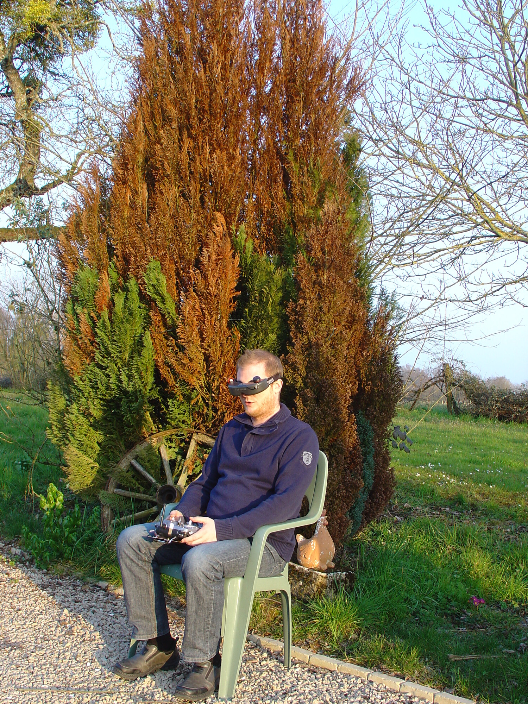

Dieses Weekend waren wir auf einem Familienausflug in Dongalon (FR), welchen ich wunderbar zum fliegen mit meiner Nighthawk 250 brauchen konnte.

Im verlaufe des Tages wurde ich immer mutiger und habe dabei auch diverse Rotoren zerstört. 😉 Glücklicherweise ist nie etwas ernsthaftes kaputt gegangen und ich konnte acht Akkuladungen fliegen.

Der grösste Verlust war ein "Landegestell", welches aus einem kleinen Aluminium Rohr bestand, und wohl schon beim ersten start verloren ging weil die Schraube nicht gut angezogen war. Da diese sowieso etwas zu kurz waren und ich beim start im Rasen immer ein bisschen gemäht habe, habe ich Zuhause kurzum längere gedruckt.

Nichteimal der misslungene Back-Flip am Anfang konnte der Nighthawk etwas anhaben obwohl meine Zuschauer schon das schlimmste befürchteten. 😀

Ich habe im verlaufe des Tages auch diverse Änderungen an den PID Werten getestet, was die Nighthawk interessanter (aggressiver) zum Fliegen macht. Ganz am Schluss des Videos sieht man noch zu stark eingestellte P-Werte, welche in einer sehr starken Oszillation resultierten.



Hilfreiche Links:

* [Cleanflight - PID tuning](https://github.com/cleanflight/cleanflight/blob/master/docs/PID%20tuning.md)
* [OpenTX University - CleanFlight PID Tuning](http://open-txu.org/home/special-interests/multirotor/cleanflight-pid-tuning/)
* Meine 3D Objekte sind wie immer zu finden unter: [oxi.ch/3dobjects](https://oxi.ch/3dobjects)
