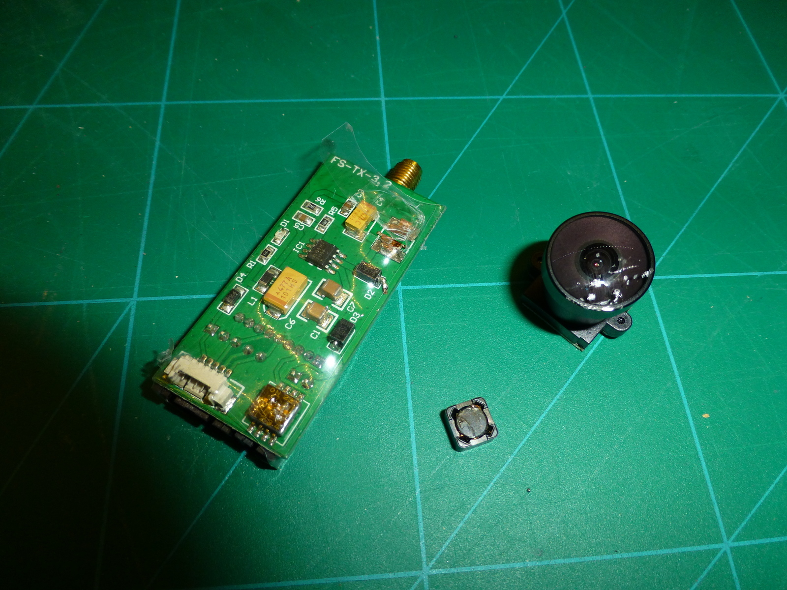

Auch wenn es hier im letzten Monat etwas ruhig war, heisst dies nicht, dass ich nicht aktiv im Bezug auf 3D-Druck und Quadcopter war. Meine Nighthawk 250 beschleunigt, seit ich <a href="http://cleanflight.com/" target="_blank">Cleanflight </a>richtig eingestellt hatte, auch wie gewünscht, und sobald an einem Wochenende tolles Wetter ist, werde ich dies auch richtig ausleben können. 😉

So sieht es aus, wenn die Sensitivität viel zu hoch eingestellt ist: 😀



Nach diesem Crash hat leider mein FatSharkVideo-Sender den Geist aufgegeben und die Mobius hat massive Kratzer in der Linse. Für beides ist für Ersatz gesorgt. In Zukunft benutze ich als Schutz <a href="http://www.thingiverse.com/thing:1012714" target="_blank">Mobius Action Camera &#8211; Protective Case&#8217;s von Thingiverse</a>.

In der Zwischenzeit habe ich dem Quadcopter ein Minim OSD verpasst, primär um damit den Ladestatus des Akkus immer im Blick zu haben.

Dies führt mich zu den 3D gedruckten Teilen, welche ich entworfen und gedruckt hatte. Mit inzwischen über zwanzig (öffentlichen) Dokumenten in <a href="https://www.onshape.com/" target="_blank">www.onshape.com</a> habe ich doch schon einiges an Erfahrung gesammelt und die Designs werden immer komplexer.

So sieht es aus, wenn mein Kossel XL etwas druckt:


* Nighthawk XT60 Mount
* Nighthawk EC3 Mount
* Nighthawk 600TVL Mount
* Nighthawk Landing Gear
* Nighthawk MinimOSD Mount
* Nighthawk RunCam Sky+ Mount
* Immersion Duo 5800V4 Mount

Meine 3D-Objekte sind wie immer zu finden unter: <a href="https://oxi.ch/3dobjects" target="_blank">oxi.ch/3dobjects</a>
