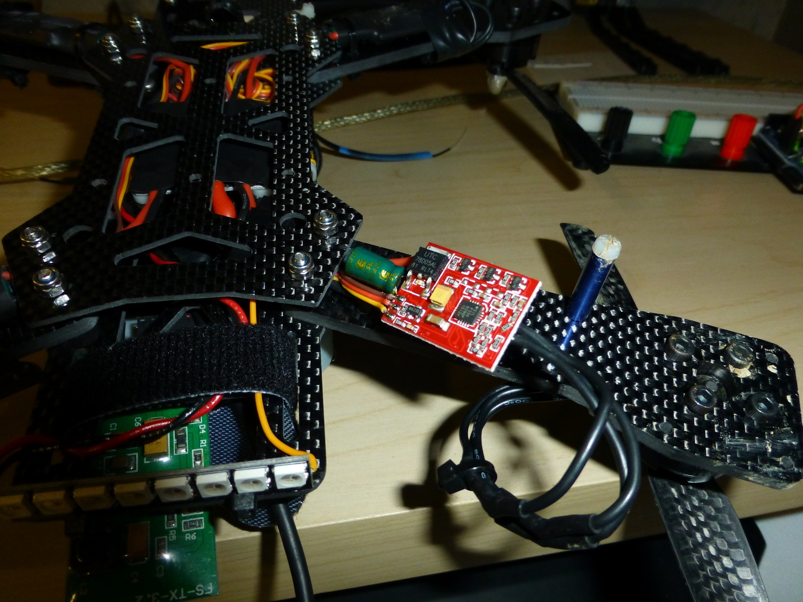
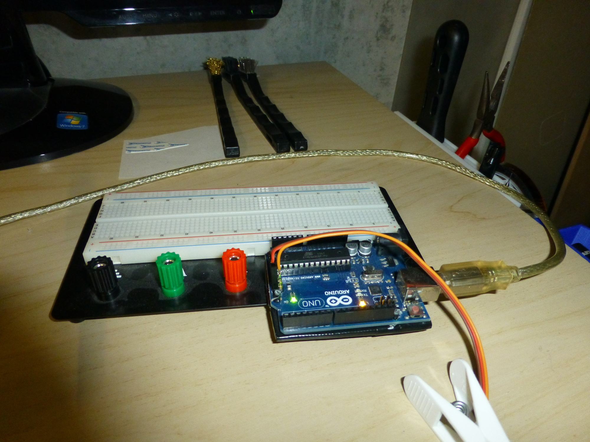
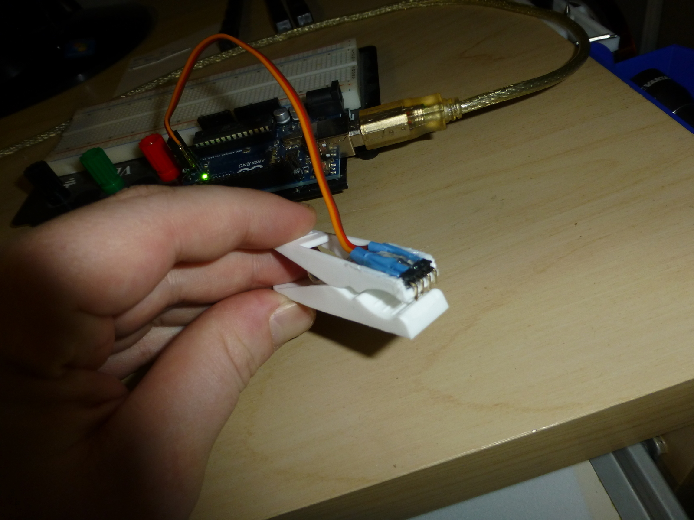
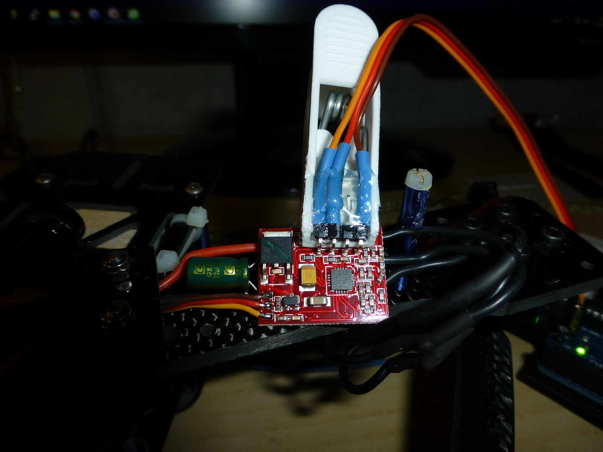
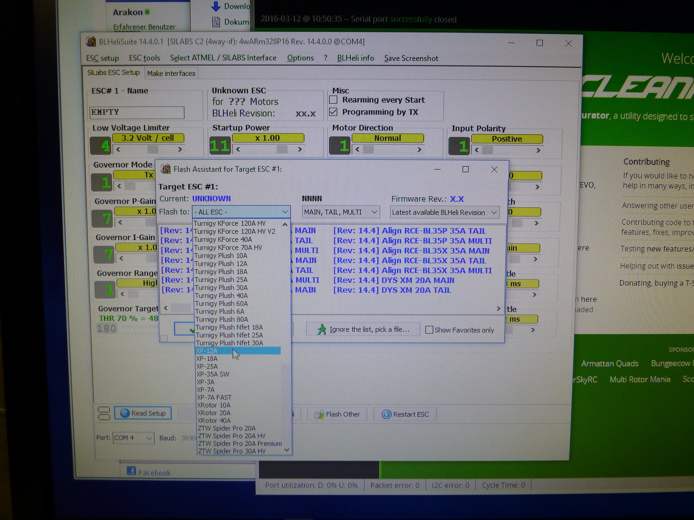

Als ich <a href="http://cleanflight.com/" target="_blank">Cleanflight</a> für meine Nighthawk auf die neuste Version aktualisiert hatte, stellte ich fest, dass die Motoren nicht mehr starteten. Nach einer Analyse hatte ich herausgefunden, dass die vorinstallierte Firmware bei den ESC&#8217;s nicht mehr kompatibel ist mit der aktuellen <a href="http://blog.oscarliang.net/oneshot125-esc-quadcopter-fpv/" target="_blank">OneShot</a> Implementation in <a href="http://cleanflight.com/" target="_blank">Cleanflight</a>.

Damit ich die Firmware aktualisieren konnte, musste ich zuerst den Schrumpfschlauch entfernen. Nach getaner Arbeit deckte ich die ESC&#8217;s mit Elektriker-Isolierband wieder ab.

Die <a href="https://blhelisuite.wordpress.com/" target="_blank">BLHeliSuite</a> hat die Möglichkeit, ein Arduino als Programmer zu benutzen, direkt eingebaut.

Die ESC&#8217;s werden über drei der vier offen liegenden Kontakte neu beschrieben. Dafür hatte ich eine Wäscheklammer mit 90°-Pin-Headers, Schrumpfschlauch und natürlich Heisskleber umgebaut.

Die Idee für diese Lösung hatte ich vom Video <a href="https://www.youtube.com/watch?v=cH-wWne3YVY" target="_blank">DIY Flashing Emax 12A Esc with BLHeli</a>.

