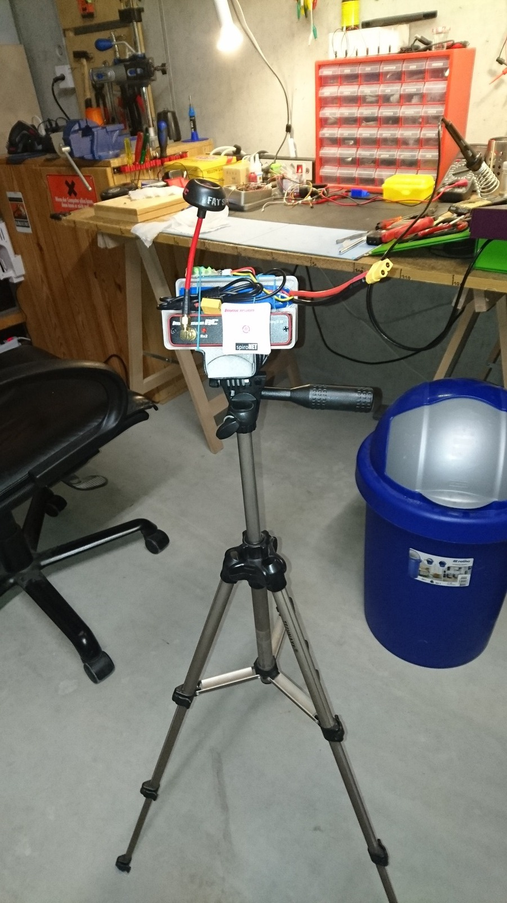

Um auch mit den in der [Schweiz legalen 25mw Video Sendern](https://rc.oxi.ch/index.php/Wichtige_Links) möglichst störungsfrei fliegen zu können, habe ich mir eine FPV Groundstation gebaut. Gleichzeitig habe ich die Aufnahme des Streams in eine Datei ermöglicht.

Die Grounstation besteht aus einem [ImmersionRC FPV DUO5800](http://www.banggood.com/ImmersionRC-FPV-DUO5800-V4_1-Race-Edition-40ch-5_8GHz-Raceband-Dual-Output-AV-Receiver-p-1020631.html) mit zwei Antennen. Durch die Diversity-Schaltung nimmt der Empfänger immer das stärkere der beiden Antennen-Signale und stellt somit das best mögliche Bild sicher.

Die verwendeten Antennen sind [ImmersionRC 5.8GHz SpiroNet 8dBi RHCP Mini Patch](http://ImmersionRC 5.8GHz SpiroNet 8dBi RHCP Mini Patch) und [ImmersionRC 5.8GHz SpiroNet RHCP Antenne V2](http://fpvracing.ch/de/fpv-zubehor/113-immersionrc-58ghz-spironet-antenna-v2-set-sma.html). Die Patch Antenne deckt einen 45° Bereich ab und wird in die Flugrichtung ausgerichtet. Falls aus diesem Bereich raus geflogen wird, wechselt das Signal zur "normalen Cloverleaf" Antenne, welche einen 360° Bereich abdeckt. Der 45° Bereich ermöglicht eine grössere Distanz zum Ausgangspunkt, wobei die 360° vor allem beim Starten und Landen zum tragen kommt.

Der Empfänger hat zudem zwei Video-Ausgänge, welche ich brauche um meine [FatShark PredatorV2](http://www.hobbyking.com/hobbyking/store/__28342__FatShark_PredatorV2_RTF_FPV_Headset_System_w_Camera_and_5_8G_TX.html) mit dem Bild zu versorgen und gleichzeitig den Stream auf einem Linux Laptop anzuzeigen (und auch zu speichern). Weitere Details dazu wie ich das umgesetzt habe, sind auf meiner [RC Wiki Seite](https://rc.oxi.ch/index.php/Benutzer:Oxi/FPV_Setup) zu finden.

Damit der DUO5800 auf dem Stativ montiert werden kann, habe ich in [onshape](http://onshape.com) eine Halterung entworfen. Diese wurde anschliessend auf meinem 3D Drucker produziert und verrichtet gute Dienste. Die .STL Dateien können von meiner [3D Objekte](https://oxi.ch/3dobjects) Website aus dem Ordner "RC FPV" heruntergeladen werden.

Am Schluss, habe ich noch ein zusätzliches Strom-Kabel vom Akku der Groundstation zur FatShark hinzugefügt. So muss ich nicht mehr die unpraktische Batterie am Kopf tragen und habe auch eine bessere Übersicht wann die FPV Batterien geladen werden muss.
