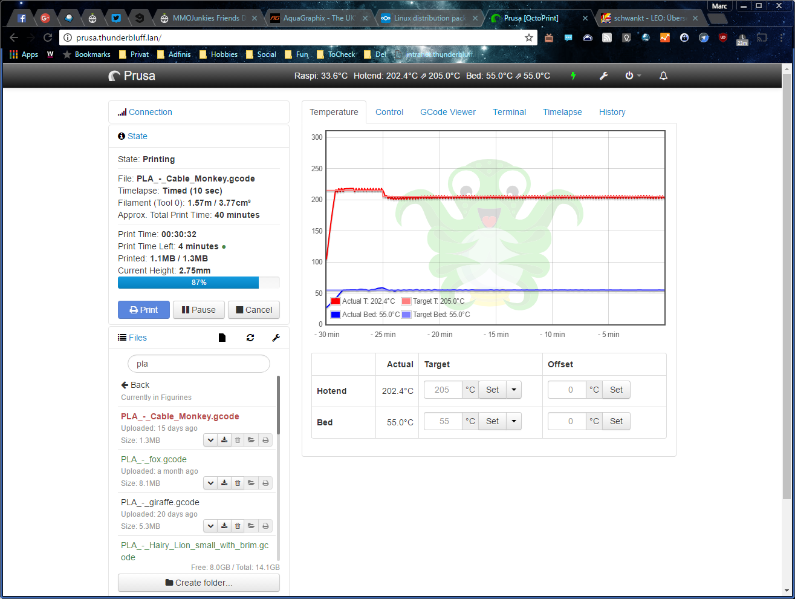
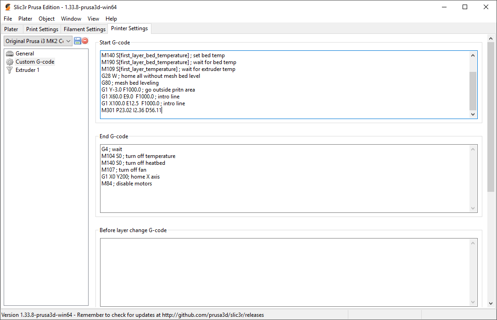
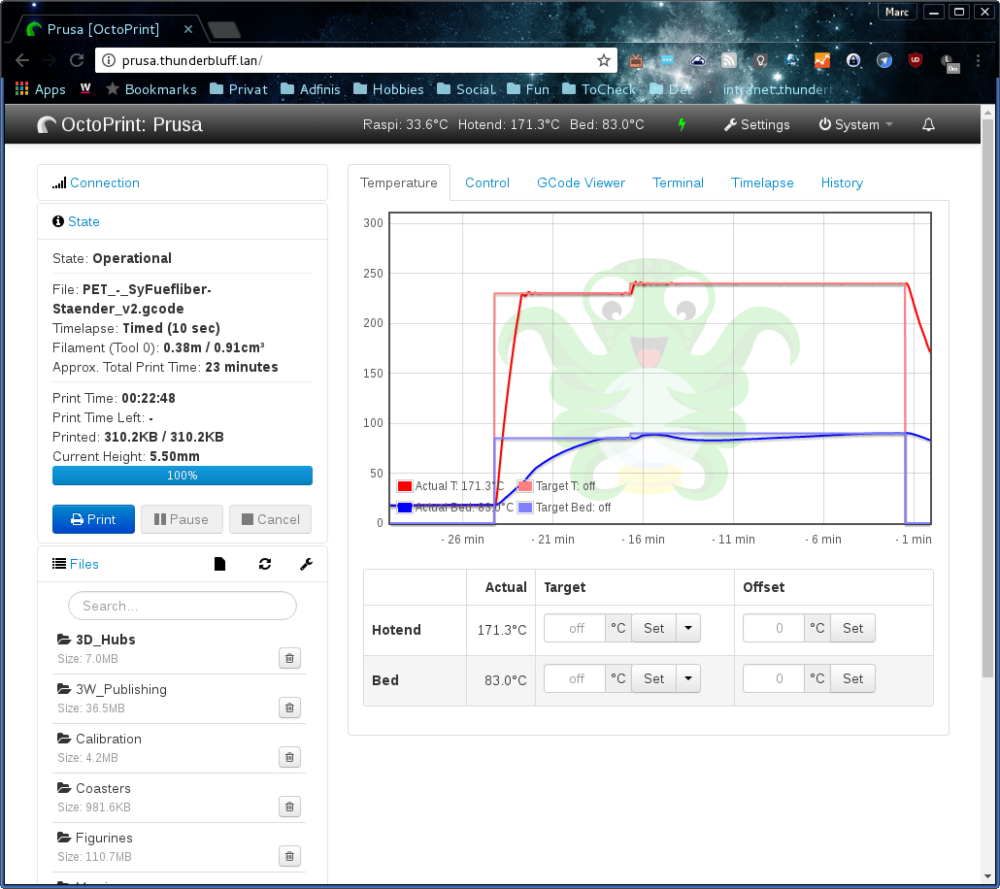

This content is available as a German video and English blog post.

Why do you need to tune the <a href="https://en.wikipedia.org/wiki/PID_controller" target="_blank">PID</a> loop?
One possible reason can be, if you changed the hotend or parts of it.

Another would be, that you did the Voltage &#8220;hack&#8221; as described by Thomas Sanladerer to get the hotend and heated bed heat faster. This &#8220;hack&#8221; is not supported and even highly discouraged by Prusaresearch, since it addressed a long gone issues! YOU LOOSE YOUR WARRANTY if you do that and Joseph will get angry at you. And now read this paragraph again before fiddling around with electronics! But I had to mention it, because it was the reason I did this PID tuning blog and video in the first place.<!--more-->

The Prusa 3D printers firmware is based on <a href="https://github.com/MarlinFirmware/Marlin" target="_blank">Marlin</a>, a open source firmware for <a href="http://reprap.org/" target="_blank">RepRap 3D printers</a> based on the Arduino platform. If you do not have a preconfigured 3d printer running on Marlin like a Prusa, you should do this in any case to get the most stable temperature.

So, why do we even need a PID controller and what does it do?
PID loops are used in a variety of applications all over the industry and also in many other household or even hobby devices like my quadcopters for example. The three letters stand for:
P = proportional
I = integral
D = derivative

Wikipedia describes it the following way:

> A PID controller continuously calculates an error value as the difference between a desired setpoint and a measured process variable and applies a correction based on proportional, integral, and derivative terms which give their name to the controller type.

In our case, the PID loop controls the temperature of the hotend and in some printers even the heatbed or the enclosure. Without a PID loop, the 3D printer would heat until it reads the targeted temperature and would then switch off the heating completely. Since it takes a while until the heat gets generated in the heating element, then heats the hotend block and finally gets read from the temperature sensor, this will lead to a overshoot of the temperature. And since it is the same with cooling down, the temperature would then fall significantly under the desired value. To tackle this problems, the PID loop counteracts this sluggishness by calculating what heating power leads to the desired temperature and keeps it stable there.

So what is required to optimize the heating:
A Prusa i3 or any other Marlin based 3D printer and a method to send it commands over a serial console.
My second printer, the Kossel XL, a china kit, is also a RepRap derivate which runs with Marlin and all that applies for this one too. In fact a lot of 3D printers used today are derived from the RepRap Project.

<a href="http://octoprint.org/" target="_blank">Octoprint</a> is a web interface for 3D printers which can easily be used on a Raspberry Pi, which makes controlling and monitoring of your 3D printer very convenient. I can highly recommend it, especially if your printer is for example in your basement like in my case.

The Prusa version of Marlin does not support saving to the EEPROM memory within the printer because it seems to be buggy in the forked version of Marlin. Because of this we either have to apply the new PID values to the configuration and compile the firmware new, which is pretty complicated, or we have to apply the changed PID values after each start of the printer or even before each print in that matter.

This can either be done with Octoprint or in your slicer. I prefer Octoprint, since I then can use any slicer software without configuring each of them separately.

Now, this is how the temperature curve looked before the PID tuning was done on my Prusa printer. As you can see, the temperature of the hotend fluctuated quiet a lot within a 5 °C range, this can be quiet important for your print quality depending on the material.

The PID tuning process is automated within the Marlin firmware. All you have to do, is to initiate it in some kind of Serial console where you can send G-Code directly to your printer. I will be again using Octoprint for this, but you can also use Pronterface or <a href="https://www.simplify3d.com/" target="_blank">Simplify3D</a>.

> Once you have a terminal, you initiate the process by executing the M303 command, which takes three options. The first is which heating element should be tuned and can be omitted if you just want to tune your first hotend. For the sake of completeness, I will add the option anyway. E0 is the first hotend, E1 the second and so on where E-1 is the heated bed. The second option is the target temperature. You should choose the mostly used average of your printing temperature. Since I print a lot of PLA and PET, i will use 230°C. The last one is the number of loops it does to perfect the values. In my case I used 10 loops, which leads to the following command:
>
> M303 E0 S230 C10

In Octoprint, I recommend ticking the boxes to suppress as many output as possible to minimize the chance of missing the result.
After sending the command to the printer, it will take some minutes to complete. You can watch it work in the temperature graph but you have to make sure not to miss the end result which are printed in the terminal and look something like this:

> Kp: 21.73
> Ki: 2.19
> Kd: 53.85
> PID Autotune finished! Put the last Kp, Ki and Kd constants from above into Configuration.h.

So the resulting values are:

> P = 21.73
> I = 2.19
> D = 53.85

Please understand, that you will most likely never get the exact same numbers if you run the tune multiple times. It is depending on so many environment variables, that a perfect reproduction is most unlikely. All the values are working in concert to give you the desired result.

If you do not use the Prusa Marlin version, you can try to store your setting in the EEPROM. After setting it with the E301 command, you can use the M500 command to do so.

As long as you do not flash a new firmware, these settings will be loaded on every start of the printer and you do not have to do anything further.

This is how you configure Octoprint to use your new settings. You open the Octoprint settings and go to GCODE scripts. You now can enter the g-code in &#8220;before print job starts&#8221; and/or if you like in &#8220;after connection to printer is established&#8221;. I configured it in both fields so that I can be sure it is applied even if I&nbsp;play around in the terminal or something like that.

To save it in <a href="http://slic3r.org/" target="_blank">slic3r</a>, you will have to edit all your printer profiles in &#8220;Printer Settings&#8221; under &#8220;Custom G-Code&#8221; in &#8220;Start G-Code&#8221;. Remember to save every profile before you configure the next one.

To configure the commercial slicer Simplify3D, you have to configure your process in &#8220;Scripts&#8221; under &#8220;Starting Script&#8221;. Please remember to check this setting if you change printer profiles.

And this is how it looks after the tuning. The print quality will surely benefit if the temperature is stable!

Used terminal commands:
  * Start PID tuning: M303 E0 S230 C10
  * Store/use new Values: M301 P21.73 I2.19 D53.85
  * Save settings to EEPROM: M500

Slicer Links:
  * <a href="http://octoprint.org/" target="_blank">http://octoprint.org/</a>
  * <a href="https://www.simplify3d.com/" target="_blank">https://www.simplify3d.com/</a>
  * <a href="http://slic3r.org/" target="_blank">http://slic3r.org/</a>

The referenced Video from Thomas (please read the disclaimer at the top!) is linked in <a href="http://shop.prusa3d.com/forum/original-prusa-i3-mk2-f23/tom-sanladerer-s-voltage-mod-is-it-safe--t2483.html" target="_blank">this thread</a>:

Informative Links:
  * <a href="https://github.com/MarlinFirmware/Marlin" target="_blank">https://github.com/MarlinFirmware/Marlin</a>
  * <a href="https://en.wikipedia.org/wiki/PID_controller" target="_blank">https://en.wikipedia.org/wiki/PID_controller</a>
  * <a href="http://reprap.org/" target="_blank">http://reprap.org/</a>
