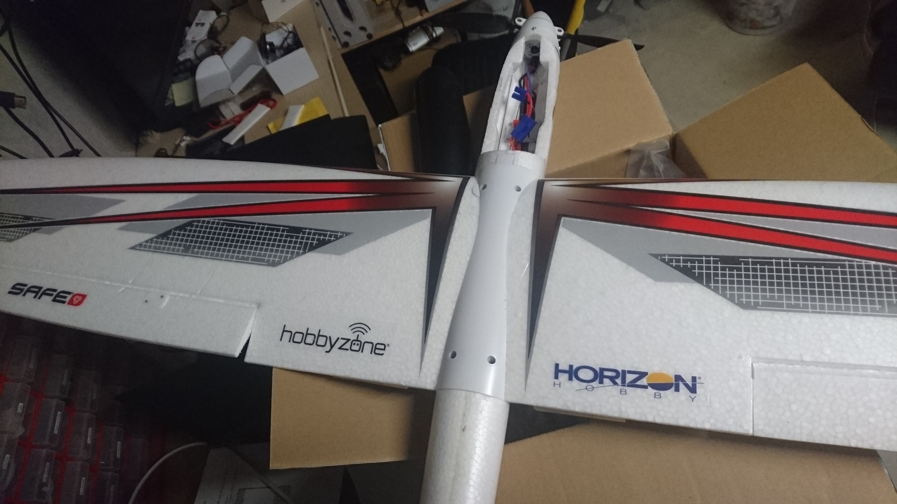

Am 4. Juni wurde bei mir ein Segelflieger Conscendo von HorizonHobby abgegeben, dessen Halter ich bis heute nicht ausfindig machen konnte. Ich möchte den Flieger jedoch gerne zurückgeben. Er wurde zwischen Deitingen und Wangen an der Hauptstrasse gefunden, also ca.&nbsp;<a href="https://goo.gl/maps/MUfq4FG5xzj" target="_blank" rel="noopener">hier</a>. Falls ihr den Halter kennt oder ihn selber vermisst, nehmt doch mit [mir Kontakt](/about/) auf. Merci 🙂

