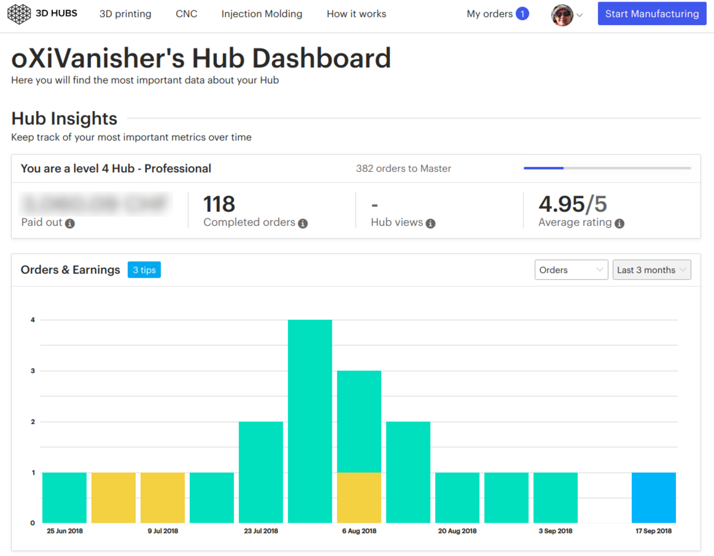
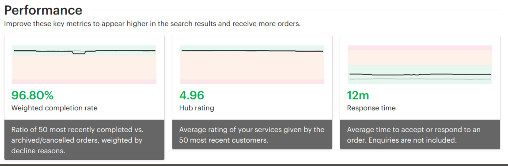

In der Vergangenheit hatte ich für und mit 3D-Hubs als Plattform 118 Druckaufträge für Kunden durchgeführt. Leider hat 3D-Hubs mit einer Vorlaufzeit von gerade mal zwei Wochen alle privaten Hubs [geschlossen](./files/3D-Hubs-Important-announcement-about-your-Hub.pdf). Davon ist auch mein Hub betroffen, denn die Anforderungen sind für eine Privatperson schlicht und einfach nicht zu erfüllen.

Die Community der 3D-Drucker hat diesen Schritt auf das <a href="https://www.reddit.com/r/3Dprinting/comments/9f6u2t/3d_hubs_are_killing_off_non_commercial_hubs/" target="_blank" rel="noopener">Schärfste verurteilt.</a>&nbsp;Schlussendlich bleibt uns nichts anderes übrig, als damit zu leben und entweder einen eigenen Service aufzubauen oder auf eine neue Plattform zu hoffen, die die alten Werte von 3D-Hubs wieder aufleben lässt.

Das Einzige was ich noch tun kann, ist den Stand meines Hubs hier zu erhalten, denn die Kennzahlen, die ich erreicht habe, waren schweizweit auf der höchsten Stufe. Natürlich strebe ich an, [meine Dienste][1] weiterhin mit der selben Zuverlässigkeit und Reaktionszeiten anzubieten, auch wenn das praktische Interface von 3D-Hubs nicht mehr verfügbar ist.

 [1]: https://oxi.ch/3d-printing/
