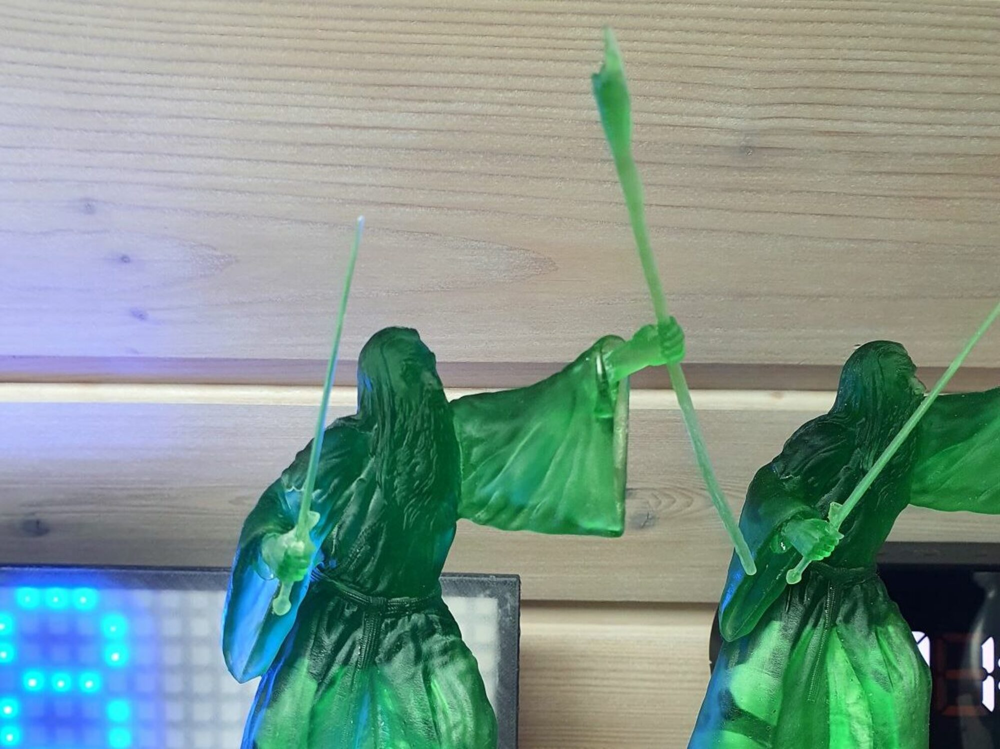

Für ein Geburtstagsgeschenk habe ich den <a rel="noreferrer noopener" href="https://www.gambody.com/3d-models/gandalf-the-gray" target="_blank">Gandalf von Gamebody</a> auf dem Elegoo Mars Pro gedruckt.<figure class="wp-block-image size-large is-style-default">

Zudem habe ich seinen Stab mit einem Micro-LED versehen und mit sehr viel Geduld die Kabel verlegt sowie eine Öffnung in die Base gemacht. Damit diese Veränderungen nicht auffallen, habe ich diese mit Milliput &#8220;Weggespachtelt&#8221;.



Nach einer Grundierung mit der Airbrush-Pistole, habe ich Gandalf mit diversen Model-Paints und Washes angemalt, sowie Details hervorgehoben. Dabei habe ich zusätzlich etwas Wet-Blending an Gandalf sowie Dry-Brushing am Stein eingesetzt.



Her eine kurze 360 Grad Vorschau.



Gandalf wurde am 20. Juli 2021 fertiggestellt.
