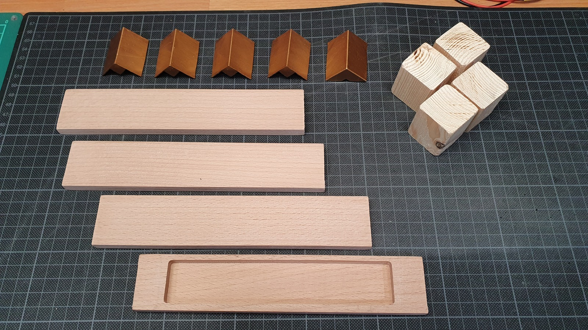

Als Fan der Stargate-Reihe hat mich das [Modell von Fr3D eines Raumschiffes](https://www.myminifactory.com/object/3d-print-spaceship-pyramid-fdm-resin-printer-needed-134069) aus dem Film und der Serie sofort angesprochen. Meine Idee für die Umsetzung war kurz zusammen gefasst das folgende:

* Die "grossen" Teile werden mit FDM gedruckt
* Die Detailreichen Panels werden mit SLA gedruckt
* Der Sockel wird nicht wie im Modell gedruckt, sondern aus Holz gefertigt
* Das Modell soll (natürlich 😉) beleuchtet werden

Bei den folgenden Bildern werden Spezialbegriffe verwendet. Hier eine kurze Erklärung einiger:

* FDM: [Fused Deposition Modeling](https://de.wikipedia.org/wiki/Fused_Deposition_Modeling) - 3D-Druck Technologie welche Rollen von Material schmilzt und quasi aufeinanderstapelnd die Teile druckt.
* (M)SLA: [Stereolithografie](https://de.wikipedia.org/wiki/Stereolithografie) - 3D-Druck Technologie welche mit UV-Licht flüssiges Harz zu den Objekten härtet.
* Dry-Brush ([Trockenbürsten](https://de.wikipedia.org/wiki/Trockenb%C3%BCrsten)): Eine Mal-Technik bei welcher nur wenig Farbe am Pinsel ist und durch feines auftragen die Struktur hervorhebt.
* [Washing](https://de.wikipedia.org/wiki/Washing): Das Modell wird mit stark verdünnter Farbe grosszügig bedeckt. Durch den [kapillaren Effekt](https://de.wikipedia.org/wiki/Kapillarität), sammelt sich die Farbe in Vertiefungen und Winkel, welche so hervorgehoben werden.
* [IPA](https://de.wikipedia.org/wiki/2-Propanol): Isopropylalkohol oder Isopropanol ist ein sehr oft verwendeter Alkohol der zur Reinigung verwendet wird.
* [TPU](https://de.wikipedia.org/wiki/Polyurethane): Gummiges Material welches mit der FDM Technologie gedruckt werden kann. Wird oft bei FPV-Drohnen verwendet.
* [PVA](https://de.wikipedia.org/wiki/Polyvinylalkohol): Sehr weit verbreitete art von Leim. Verwandt mit/oder Alias zu Holzleim und Weissleim.

## SLA Druck



## Pyramiden Raumschiff

Um die Bilder grösser anzuschauen, einfach darauf klicken.



## Wüste mit Pyramide



## LED-Beleuchtung Pyramide



## Sockel Ecken {#sockel-ecken}



## Holzarbeiten Sockel

Mit diesen Teilen wollte ich anfangs den Sockel bauen.



Nach dem Fräsen





## Bohrung für USB-C Stromversorgung



## Stargate Logo



## Montage Sockel



## Elektronik



## Sockel Ecken ankleben



## Endlich fertig!



Der Bau dieses Dioramas hat ca. einen Monat gedauert. Reine Arbeitszeit wäre wohl zwei bis drei Arbeitstage mit zusätzlichen ein bis zwei Tagen für das Design der 3D-Objekte und CNC Programme. Die reine Zeit für alle 3D-Drucke war ca. fünf Tage. Es ist ferner zu bedenken dass das Trocknen lassen der Grundierungen, Farben und Leinölfirnis zusätzlich einige Tage gedauert hat.
Manchmal brauchte ich auch einfach etwas Zeit bis mir bei Problemen die "Richtige Lösung" in den Sinn gekommen ist, oder anders ausgedrückt: Bis ich die richtige Inspiration gefunden hatte um gewisse Challenges anzugehen.
Die Elektronik dauerte auch einige Tage für die komplette Umsetzung. Meine Erste Idee (mit RBG-LEDs) wäre zwar einfach umzusetzen gewesen, aber mir gefällt die Farbe der Filament-LEDs viel besser. Das herausfinden, dass die Mosfet-Baasierte Fertig-Komponente mit 3.3V nicht schaltet und wirklich 5V, welche ich vom ESP8266 nicht erhalte, dauerte dann auch noch eine Weile. Dank der Hilfe meines Kollegen, war es dann aber doch noch möglich das Problem sauber zu lösen und nach einem Abend Löten und einem weiteren Nachmittag zum herausfinden dass Relais-Diagramme immer von unten gezeichnet sind (Standards sind ja dafür da ignoriert zu werden) 😒 konnte das Projekt erfolgreich abgeschlossen werden.

Die Pyramide wurde am 19. November 2021 fertiggestellt.
