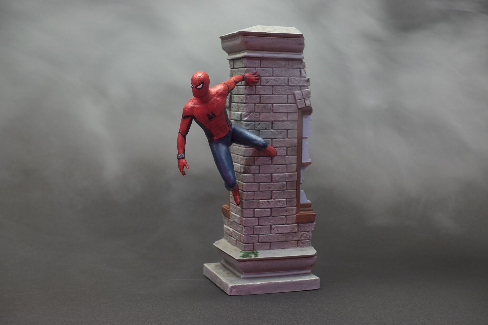

Ich verwende hier das <a rel="noreferrer noopener" href="https://www.gambody.com/3d-models/spider-man-wall-crawler" target="_blank">Spider-Man Wall Crawler 3D Printing Figurine</a> Modell vom Creator <a rel="noreferrer noopener" href="https://www.gambody.com/user/view/id/3830" target="_blank">Rodman</a>. Der druck dauerte ca. zehn, alle Mal-Arbeiten zusätzlich ca. zwanzig Stunden.



Spidey wurde am 20. Dezember 2021 fertiggestellt.
