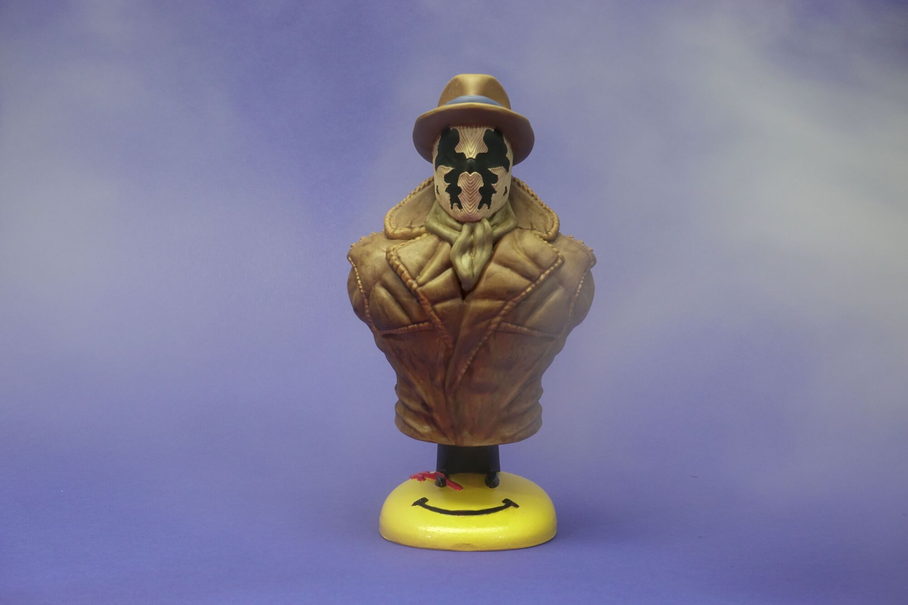

Rorschach ist ein Anti-Held aus dem Watchmen Universum von DC Comics. Nach langer Zeit habe ich wieder einmal den Film aus dem Jahr 2009 (diesmal in der 3.5 Stunden-Fassung 😍) geschaut habe, hatte ich Lust meinen Lieblings-Charakter &#8220;Rorschach&#8221; zu bemalen. Die verwendete 3D-Datei ist gratis bei <a rel="noreferrer noopener" href="https://www.myminifactory.com/object/3d-print-rorschach-from-watchmen-support-free-108809" target="_blank">MyMinifactory</a> zu finden.

Die Mal-arbeiten dauerten ca. 10 Stunden.



Rorschach wurde am 18. Dezember 2021 fertiggestellt.
