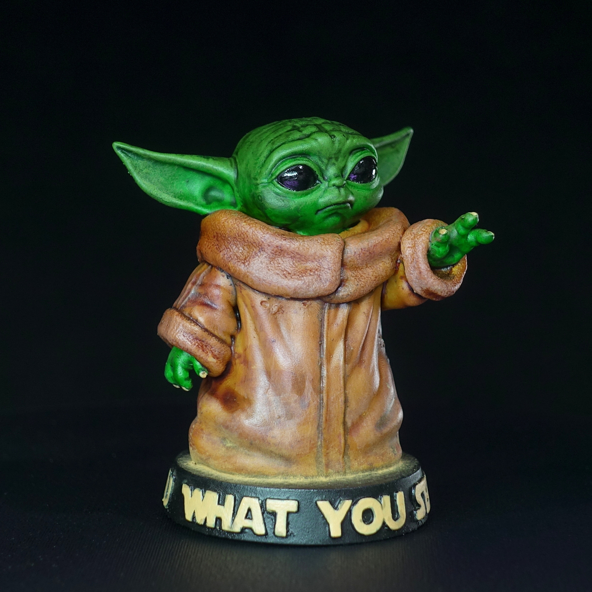

Vor zwei Jahren habe ich meinen ersten Resin MSLA-3D-Drucker, einen Elegoo Pars Pro gekauft. Einer meiner ersten Drucke ist nun endlich bemalt worden. Ich habe die SpeedPaints von ArmyPainter dafür verwendet, welche den Vorgang massiv schneller gemacht haben. Zudem habe ich zum ersten mal mit Pigmenten gearbeitet um den Wüstenstaub am Grogus Gewand zu simulieren.



Grogu wurde am 12. April 2022 fertiggestellt.
