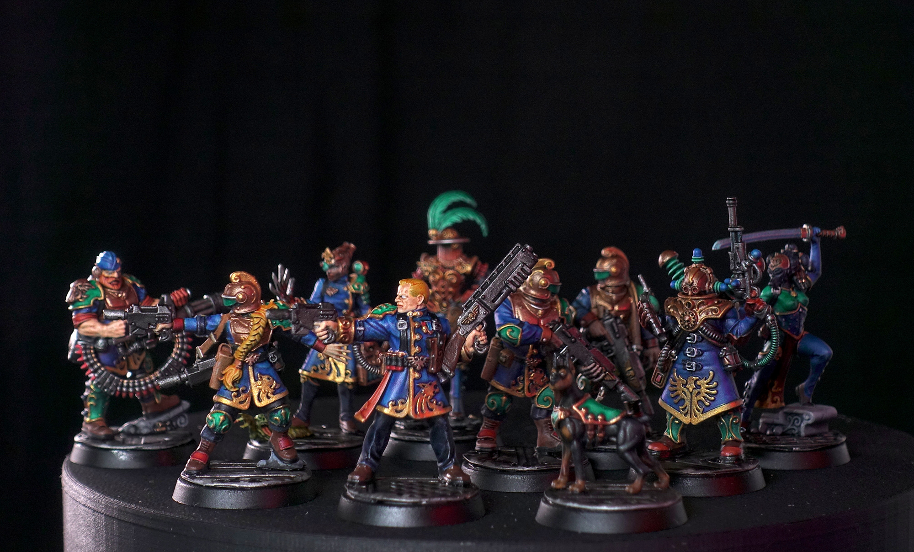

Diese Warhammer Kill Team Figuren mussten mehr als 1.5 Jahre darauf warten, um nach dem Grundieren etwas Farbe zu erhalten. Bei einem Team mit zehn Figuren ist es schwierig dies mit Fotos so festzuhalten, dass es verständlich ist. Ich habe mein bestes gegeben um aus den 314 Bildern sinnvolle auszuwählen. 😂
Die gesamten Mal-Arbeiten dauerten ca. 20 Stunden.



Die Starstriders wurden am 28. Mai 2022 fertiggestellt.
