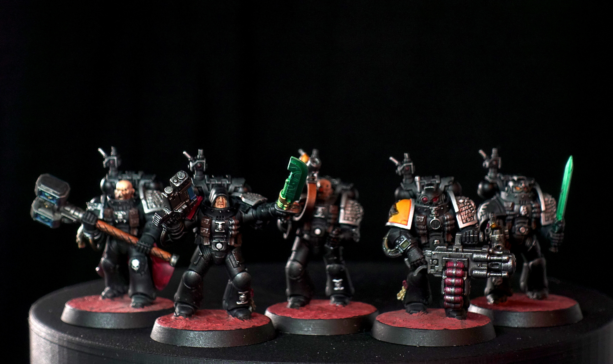

Dieses Kill Team ist in relativ kurzer Zeit entstanden. Dies auch wieder dank den Speed-Paints von The Army Painter.
Der Zusammenbau dauerte ca. eine, das Bemalen ca. sieben Stunden (ohne die Bases).



Das Death Watch Kill Team wurde am 18. Juni 2022 fertiggestellt.
