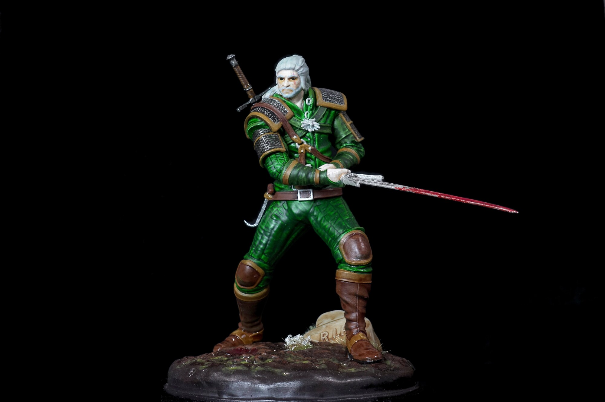

Für das Release der zweiten Staffel von The Witcher bei Netflix hatte ich vor, Parallel zum schauen der Serie Gerald von Rivia zu bemalen. Leider war die 2. Staffel etwa 2 Stunden zu kurz dafür. 😅 Somit dauerten die Mal-arbeiten ca. 10 Stunden. Und ja, das ist schon ein paar Monate her.



Gerald von Rivia wurde am 26. Dezember 2022 fertiggestellt.
