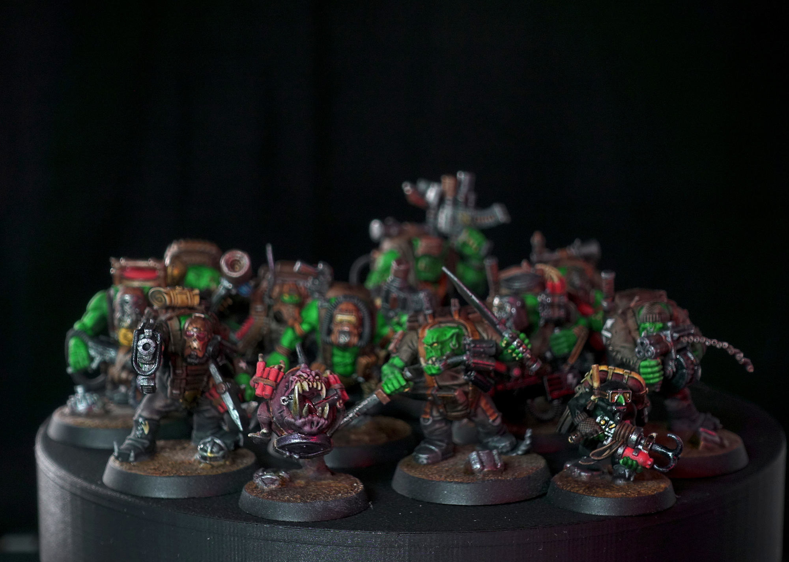
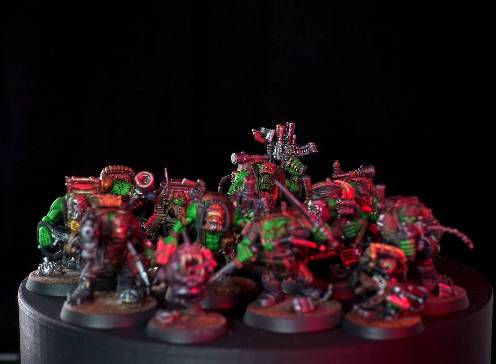
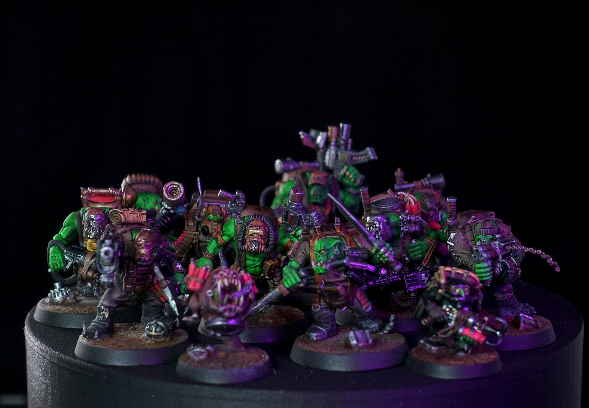

Aus der Kill Team Box Octarius von Games Workshop stammen die Ork Kommandos. Die reinen Mal-Arbeiten dauerten ca. 20 Stunden. Am Anfang ging es dank den Speed-Paints relativ schnell, aber all die Details der 12 Modelle dann hervor zu heben dauerte schlussendlich viel länger als erwartet.

Die Bases gingen ebenfalls überraschend lange. An diesen habe ich Total ca. vier Stunden gearbeitet. Teilweise war es aufwändiger als ich gedacht hatte, aber manchmal hatte ich auch einfach dumme Fehler gemacht, nach welchen ich erneut Malen musste. 🤷‍♂️



Für die Bases habe ich von <a rel="noreferrer noopener" href="https://www.youtube.com/watch?v=fihnIwq7yc0" target="_blank">diesem Video von EonsOfBattle</a> inspirieren lassen.

Da dieses Kill Team aus 12 Figuren besteht, war auch hier die Auswahl der Bilder schwierig und dies ist nur eine Selektion der fast 300 Fotos.



Es folgen alle 12 Figuren mit &#8220;Namen&#8221;



Das Ork Kommando Kill Team wurde am 17. Juli 2022 fertiggestellt.
